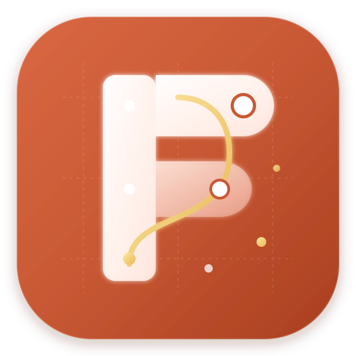
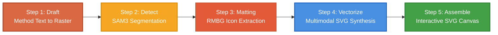

<div align="center">
  
  <h1>FigOne</h1>
  <p><strong>Next-Generation Academic Figure Generation & Vector Editing Studio</strong></p>
  <p><em>Turn paper method descriptions and raster diagrams into publication-ready, modular, and fully editable SVGs powered by Multimodal AI & SAM3.</em></p>

  <p>
    <a href="https://github.com/jhxxr/FigOne/releases"></a>
    <a href="https://github.com/jhxxr/FigOne/blob/main/LICENSE"></a>
    <a href="#"></a>
    <a href="#"></a>
    <a href="#"></a>
    <a href="#"></a>
    <a href="https://github.com/jhxxr/FigOne/stargazers"></a>
  </p>

  <p>
    <strong>English</strong> | <a href="README_CN.md">中文说明</a>
  </p>

  <p>
    <a href="#-overview">Overview</a> •
    <a href="#-key-features">Key Features</a> •
    <a href="#-pipeline--architecture">Architecture</a> •
    <a href="#-quick-start">Quick Start</a> •
    <a href="#-workflows-guide">Workflows</a> •
    <a href="#-provider-and-model-configuration">Configuration</a> •
    <a href="#-development-setup">Development</a> •
    <a href="#-contributing">Contributing</a>
  </p>
</div>

---

## 🌟 Overview

Creating clear, aesthetically pleasing, and publication-standard scientific figures is often one of the most time-consuming parts of writing academic papers. 

- **Traditional generative diffusion/LLMs** (DALL-E 3, Midjourney, Stable Diffusion) produce flat raster images with uneditable elements, blurry text, and hallucinated formulas.
- **Traditional vector drawing tools** (Adobe Illustrator, Inkscape, Draw.io) require hours of painstaking manual drawing and alignment.

**FigOne** solves this problem by pioneering a **decoupled, multi-stage generative pipeline**:
1. **Semantic Conceptualization**: Converts paper method text into a high-level visual draft (or accepts your existing raster figures).
2. **Neural Decomposition**: Uses **SAM3** (*Segment Anything Model 3*) and **RMBG 2.0** to detect visual entities, extract icons, and remove background noise.
3. **Multimodal Vector Reconstruction**: Employs leading Vision-Language Models (GPT-4.1 / GPT-5.5 / Gemini 3.1 Pro / Claude 3.7) to reconstruct structured, cleanly grouped SVG vector diagrams.
4. **Interactive In-App Canvas**: Allows instant tweaking of nodes, text, shapes, arrow lines, and colors directly inside the integrated vector editor.

```text
[ Method Text ] ──> [ 1. Raster Draft ] ──> [ 2. SAM3 Segmentation ] ──> [ 3. RMBG Matting ]
                                                                                   │
[ Editable SVG ] <── [ In-App Vector Canvas ] <── [ 5. Assembly ] <── [ 4. Multimodal SVG LLM ]
```

---

## 🚀 Key Features

- 📝 **End-to-End Method-to-Figure Generation**  
  Paste your paper's method section, and FigOne automatically plans layout hierarchy, visual flow, entity relations, and produces a complete vector figure.

- 🖼️ **Import & Vectorize Existing Figures**  
  Already have a preliminary raster figure, flowchart, or diagram? Import it directly to run SAM3 segmentation and multimodal SVG vectorization without re-generating from text.

- 🧠 **Smart Neural Vision Engine (SAM3 & RMBG 2.0)**  
  Local or cloud-powered detection of diagram components, icon regions, and automated background removal with crisp transparency.

- 📐 **Semantic Multimodal SVG Reconstruction**  
  Vision LLMs generate semantic, human-readable SVG markup preserving geometric alignment, clean typography, modular containers, and coordinate relationships.

- 🎨 **Built-In Interactive Vector Canvas (SVG-Edit)**  
  Directly adjust elements inside the desktop application: drag bounding boxes, alter stroke colors, edit labels, replace icons, and re-export in vector SVG or high-resolution raster.

- ⚡ **Local Hardware Acceleration & Cloud Flexibility**  
  Run local SAM3 models with GPU CUDA / CPU acceleration, or seamlessly switch to cloud backends (fal.ai, Roboflow) with zero setup.

- 🌐 **Comprehensive Multi-Provider Routing**  
  Integrated support for OpenAI Responses & Images, Google Gemini, OpenRouter, 便携AI (Bianxie AI), and custom OpenAI-compatible relay endpoints.

- 📦 **Zero-Config Windows Desktop App**  
  Engineered with **Tauri 2** (Rust) and bundled with an isolated Python environment for high performance, low resource footprint, and zero Python environment hassle for end users.

---

## 🔄 Pipeline & Architecture

FigOne orchestrates a 5-step collaborative intelligence pipeline:



| Step | Stage | Description |
| :--- | :--- | :--- |
| **01** | **Generate / Import** | Generates an initial academic raster figure (`figure.png`) from method text via image models (e.g. `gpt-image-2`) or imports an existing user image. |
| **02** | **SAM3 Segmentation** | Detects diagram icons, arrows, modules, and sub-blocks, outputting coordinate bounding boxes and metadata. |
| **03** | **Icon Matting** | Crops detected icon regions and applies RMBG 2.0 background removal for transparent vector placement. |
| **04** | **SVG Reconstruction** | Multimodal LLMs (Gemini / GPT / Claude) inspect the layout and generate structural SVG markup with placeholder alignments. |
| **05** | **Assembly & Canvas** | Injects processed icons into SVG coordinates and opens the interactive canvas for vector manipulation and export. |

---

## ⚡ Quick Start

### Option 1: Download Desktop Installer (Recommended for Users)

1. Go to the [**Latest Releases**](https://github.com/jhxxr/FigOne/releases) page.
2. Download the `FigOne_x.x.x_x64-setup.exe` installer.
3. Run the installer to install FigOne on Windows.
4. Launch FigOne, open **Models & Providers**, and add your API keys.

> **Note on Local SAM3 Weight**:  
> To keep the installer lightweight, the local SAM3 checkpoint (`sam3.pt`) is not pre-packaged. You can either import your local `sam3.pt` in the app settings or use cloud backends (fal.ai / Roboflow).

---

## 📖 Workflows Guide

### 1. Method Text Workflow (`/index.html`)
- **Best for**: Starting from scratch with paper methodology.
- **How to use**:
  1. Paste your structured methodology or algorithm overview.
  2. Select your saved **Provider Profile** (e.g., OpenAI or Gemini).
  3. Click **Confirm -> Canvas** to start the automatic 5-stage generation.

### 2. Import Existing Figure Workflow (`/import.html`)
- **Best for**: You already created a draft figure (via PPT, Midjourney, DALL-E, or pencil sketch) and want to vectorize/edit it.
- **How to use**:
  1. Upload your raster figure (`.png`, `.jpg`, `.webp`).
  2. Choose your multimodal SVG model and SAM backend.
  3. Click **Launch Vectorization** to proceed directly to segmentation and SVG reconstruction.

### 3. Interactive Vector Canvas (`/canvas.html`)
- Inspect step-by-step progress and real-time execution logs.
- Live-edit the reconstructed SVG with standard vector tools (select, move, rotate, resize, recolor, modify text).
- Re-run SVG synthesis with alternative prompts or multimodal models on the fly.
- Export as clean `.svg` or high-dpi `.png`.

---

## ⚙️ Provider and Model Configuration

FigOne provides a unified **Models & Providers** hub supporting flexible hybrid routing:

| Provider | Supported Capabilities | Recommended Use Case |
| :--- | :--- | :--- |
| **便携AI (Bianxie AI)** | All-in-One API Gateway | Fast, one-stop access for Chinese users with unified billing |
| **OpenAI Responses** | Reasoning & Vision LLMs (`gpt-4.1`, `gpt-5.5`) | High-precision SVG code generation & structured layout |
| **OpenAI Images** | Raster Generation (`gpt-image-2`, `dall-e-3`) | High-quality conceptual diagram drafting |
| **Google Gemini** | Multimodal (`gemini-3.1-pro-preview`, `gemini-2.5-flash`) | Large visual context & fast SVG synthesis |
| **OpenRouter** | Multi-Model Aggregator (Claude 3.7 Sonnet, DeepSeek) | Flexible multi-model experimentation |
| **Custom Relay** | OpenAI-Compatible API Proxy | Self-hosted LLM gateways or private corporate relays |

---

## 🛠️ Development Setup

If you want to build or contribute to FigOne from source, follow these steps:

### Prerequisites
- **Node.js** >= 18
- **Rust** & **Cargo** (latest stable)
- **Python** >= 3.10
- **Windows 10/11 x64**

### 1. Clone the Repository
```bash
git clone https://github.com/jhxxr/FigOne.git
cd FigOne
```

### 2. Set Up Python Backend Engine
```bash
cd engine
python -m venv runtime
# Windows PowerShell
.\runtime\Scripts\Activate.ps1

# Install backend dependencies
pip install -r requirements-runtime.txt
pip install -e ./sam3-src
cd ..
```

### 3. Run Tauri Desktop in Development Mode
```bash
npx @tauri-apps/cli dev --config src-tauri/tauri.conf.json
```

### 4. Run Backend Engine Standalone (Optional Web Dev)
```bash
cd engine
python server.py
# Open http://127.0.0.1:8765 in your browser
```

### 5. Windows CPU Installer

The release installer is built by [`.github/workflows/build-tauri.yml`](.github/workflows/build-tauri.yml) on `windows-latest`. The workflow installs Python 3.12, CPU-only Torch/TorchVision, and SAM3, runs native CPU operator and package-data checks, then creates `python-runtime-cpu.zip` for the Tauri bundle. `engine/python`, the runtime ZIP, and its manifest are CI outputs and must not be committed.

The installer carries one CPU runtime archive. FigOne opens a startup progress window while it verifies and extracts the archive into the per-user data directory on first launch, then reuses the fingerprinted runtime on later launches. SAM3 and RMBG weights remain user-imported data and are not included in the installer.

---

## 📂 Repository Structure

```text
FigOne/
├── .github/
│   └── workflows/
│       └── build-tauri.yml       # GitHub Actions CI/CD release workflow
├── assets/                       # Branding logos and README screenshots
├── engine/                       # Python FastAPI backend & AI engine
│   ├── autofigure2.py            # 5-stage figure pipeline implementation
│   ├── bootstrap_sam3.py         # SAM3 environment bootstrapping
│   ├── server.py                 # FastAPI endpoints, job queue, and routing
│   ├── requirements-runtime.txt  # Python runtime dependencies
│   ├── rmbg2-src/                # RMBG background matting integration
│   ├── sam3-src/                 # Segment Anything 3 source tree
│   └── web/                      # Frontend UI (HTML5, Vanilla CSS & JS)
│       ├── canvas.html           # In-app vector canvas (SVG-Edit)
│       ├── index.html            # Method text workflow UI
│       ├── import.html           # Image import workflow UI
│       └── models.html           # Models & provider configuration hub
└── src-tauri/                    # Tauri 2 Windows desktop shell (Rust)
    ├── src/main.rs               # Desktop lifecycle & window management
    ├── tauri.conf.json           # Tauri bundle configuration
    └── Cargo.toml                # Rust dependencies
```

---

## 🗺️ Roadmap

- [x] **v0.1.x**: End-to-end Method Text to SVG workflow & Tauri 2 Windows shell.
- [x] **v0.1.x**: Import workflow for existing raster diagrams.
- [x] **v0.1.x**: In-app embedded SVG-Edit canvas with checkpoint recovery.
- [ ] **v0.2.0**: Native LaTeX equation & mathematical typography rendering in SVG.
- [ ] **v0.2.5**: Cross-platform support (macOS Apple Silicon & Linux).
- [ ] **v0.3.0**: Fine-tuned visual graph layout models & custom academic style presets.
- [ ] **v0.4.0**: Batch figure processing & multi-figure document project management.

---

## 🤝 Contributing

Contributions, bug reports, and feature requests are very welcome!

1. **Fork** the repository.
2. Create your feature branch (`git checkout -b feature/amazing-feature`).
3. Commit your changes (`git commit -m "feat: add amazing feature"`).
4. Push to the branch (`git push origin feature/amazing-feature`).
5. Open a **Pull Request**.

Please ensure your code conforms to existing styling and passes `cargo check` and Python linting before submitting.

---

## 📄 License

This project is licensed under the **MIT License** - see the [LICENSE](LICENSE) file for details.

---

<div align="center">
  <sub>Built with ❤️ for researchers, academics, and creators worldwide.</sub>
</div>
